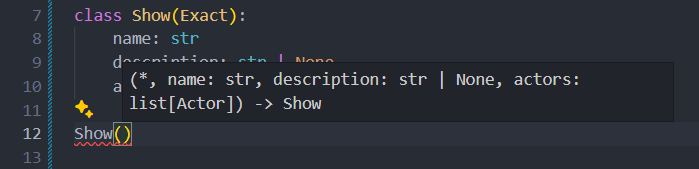

# Exacting

> *(adj.) making great demands on one's skill, attention, or other resources.*

`exacting` is a picky dataclass runtime utility collection, making sure all type annotations are followed.

Essentially... **THE** go-to option for dataclasses. heh.

**🔑 Key features**:

- **100% static typing.** Because I hate nothing too.
- Generally **faster** than [`pydantic`](https://pydantic.dev)!



<br />

**🛍️ Get `exacting`**:

=== "pip"

    ``` haskell
    pip install -U exacting
    ```

=== "uv"

    ``` haskell
    uv pip install -U exacting
    ```

=== "git"

    ``` shell
    git clone https://github.com/AWeirdDev/exacting
    ```

**🔥 Define some model**:

=== "Python 3.10+"

    ```python
    from exacting import Exact

    class Actor(Exact):
        name: str
        portrays: str

    class Show(Exact):
        name: str
        description: str | None
        actors: list[Actor]
    ```

=== "Python <= 3.9"

    ```python
    from typing import List, Optional
    from exacting import Exact

    class Actor(Exact):
        name: str
        portrays: str

    class Show(Exact):
        name: str
        description: Optional[str]
        actors: List[Actor]
    ```

**📦 Build 'em**:

```python
# (1) ✅ OK, exacting is happi
Show(
    name="Severance",
    description="great show",
    actors=[
        Actor(name="Adam Scott", portrays="Mark S."),
        Actor(name="Britt Lower", portrays="Helly R."),
    ]
)

# (2) ❌ Nuh-uh, exacting is angri
Show(
    name=123,
    description=False,
    actors=[
        "Walter White",
        "Jesse Pinkman"
    ]
)
```

??? failure "ValidationError: During validation of…"

    ``` python
    ValidationError:
    During validation of dataclass Show at field 'name', got:
      • Expected type <class 'str'>, got <class 'int'>
    ```

Normally, when you use the parameters passed in example (2) above, the Python `dataclasses` library might as well just go with it, because they only put the additional **static typing** to the model, but not at **runtime**. Exacting makes sure that at both times, types are all enforced. It even gives you a detailed error message on where this occurs! (In a cool way)

It's worth noting that error generations are *lazy*, which means once Exacting finds out about a problem about a dataclass, it raises a `ValidationError`. This saves a lot of computation time if you have a larger model.

